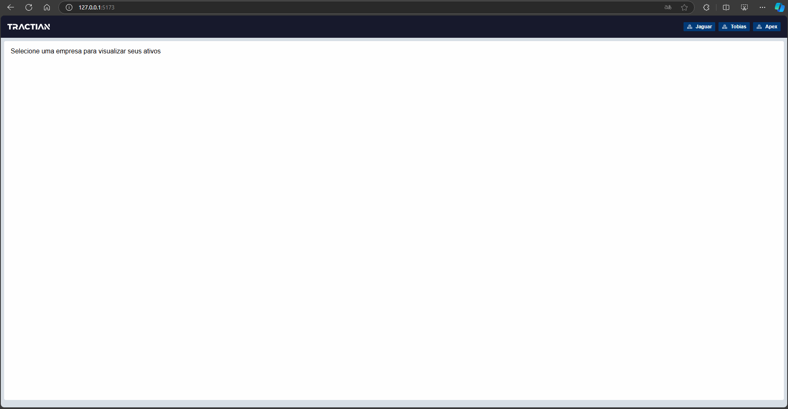

# Tractian Front End Challenge

## Descrição do Projeto

Este projeto implementa uma **árvore hierárquica** que representa os **assets** (ativos), **componentes** e **localizações** de uma empresa. A aplicação permite que os usuários naveguem e filtrem essa árvore de forma dinâmica, visualizando informações importantes como sensores de energia e status críticos dos componentes.

A aplicação foi construída utilizando React com CSS modules. O foco principal foi na **usabilidade** e **performance**, conforme os critérios estabelecidos no desafio.

## Funcionalidades

1. **Visualização da Árvore de Assets**
   - A árvore exibe localizações, assets e componentes de maneira hierárquica, como definido no desafio.
   - Ícones específicos são usados para identificar assets, localizações e componentes.
	 - A árvore de elementos é totalmente manipulavel pelo teclado.

2. **Filtros**
   - **Sensores de Energia**: Filtro que exibe apenas os componentes com sensores de energia.
   - **Status Crítico**: Filtro para mostrar assets que possuem componentes com status crítico.

3. **Manutenção da Hierarquia**
   - Mesmo com filtros aplicados, a hierarquia completa dos assets não é quebrada, permitindo que os usuários vejam o caminho completo até o item filtrado.

## Tecnologias Utilizadas

- **React** para construção da interface.
- **CSS Modules** para estilização.
- **API REST** para obtenção de dados das empresas, assets e localizações.

## Como Rodar o Projeto

1. Clone o repositório:
```bash
git clone https://github.com/GuiSelair/tractian-frontend-challenge.git
```
	
2. Instale as dependências:
```bash
npm install
```
3. Inicie o servidor de desenvolvimento:
```
npm run dev
```
4. Acessa a aplicação em http://localhost:5173

## Demonstração

Veja abaixo a demonstração da aplicação:



## Melhorias Futuras
Se tivesse mais tempo para trabalhar neste projeto, eu faria as seguintes melhorias:

- Performance: Acredito que caberia implementar uma estratégia de cache e também revisar/melhorar como a estrutura de dados é montada. 
- Testes Automatizados: Adicionaria uma boa cobertura de testes para garantir a funcionalidade
- Refinamento Visual: Melhoria alguns pontos visuais para melhorar a experiência do usuário
- Filtros: Implementaria o filtro de busca pelo nome do ativo.
- Preview do ativo: Implementaria a tela de preview de um ativo especifico, apesar da tela já exibir um ativo especifico, seria interessante enriquecer essa tela com mais informações.


## Contato
Se você tiver alguma dúvida ou quiser discutir melhorias, fique à vontade para me contatar pelo [LinkedIn](https://www.linkedin.com/in/guilherme-selair/) ou [email](mailto:contato@guilhermeselair.dev).